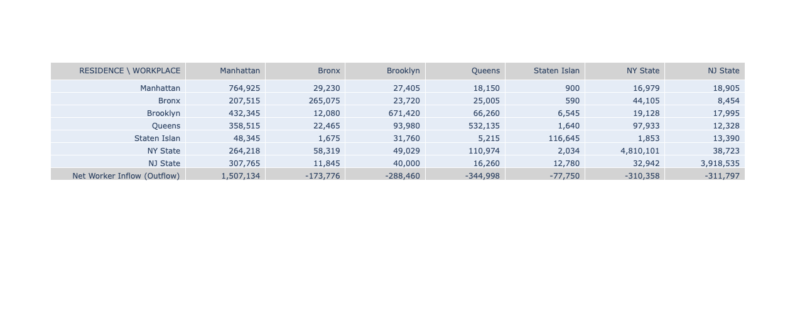
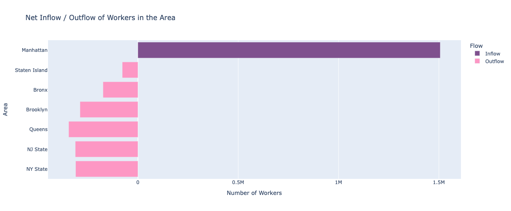
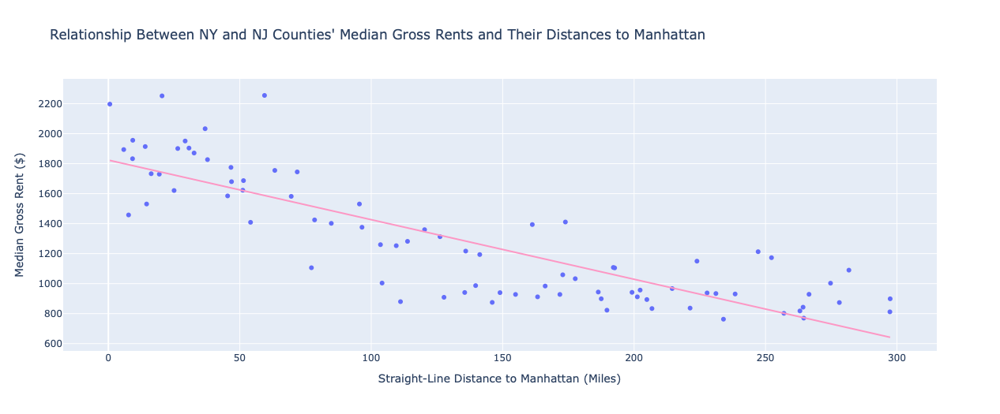

 
 
  

## Background

Studies have shown that long commutes negatively affect [health](https://www.epa.gov/sites/default/files/2019-05/documents/em_magazine_commute_and_health.pdf) and [happiness](https://mylife.adp.com/is-your-average-commute-time-affecting-your-health-and-happiness/). Unfortunately, New York City (NYC) often tops the list for the [longest commutes](https://www.visualcapitalist.com/average-commute-u-s-states-cities/) and ranks low on the Happiest Cities list for [America](https://wallethub.com/edu/happiest-places-to-live/32619) (59 out of 182) and in the [world](https://happy-city-index.com/) (207 out of 250).

It would seem that shortening the commute might make NYC workers a little happier. However, whether this is feasible requires a closer look at the commuting patterns of NYC workers and at a possible main driver of the long commute.

My study aims to answer the following three questions:
1.	What are the **commuting patterns** in the New York-New Jersey (NY-NJ) area?
2.	Is there an **association** between **rent levels** and the **distance of commute**?
 
 

## Methods
I used Python 3.12 in Google Colab to perform all data cleaning, manipulation, and the static visualizations for this project. To create the flow map, I used [FlowmapBlue](https://www.flowmap.blue/), which is a free, open-source web tool. To create an interactive map for a static webpage, I used [ArcGIS Online](https://www.arcgis.com/index.html), a web-based mapping platform for creating and publishing interactive web maps.

To analyze **patterns of worker flows in the NY-NJ area**, I downloaded the [data](assets/css/NY_NJ_Workers.csv) (ID: 302100) from the American Association of State Highway and Transportation Official (AASHTO) Census Transportation Solutions, which provides data on home and work locations and journey-to-work travel flows via its [CTTP data portal](https://ctppdata.transportation.org/#/index). I queried data for 2017-2021 (5 years) at the State-County level on the flow of workers aged 16 and over across all counties in NY and NJ.

I cleaned this data and recategorized geographic units from counties to Manhattan, Bronx, Brooklyn, Queens, Staten Island, NYS, and NJ. Using the *.groupby()* and *.sum()* functions in the *pandas* library, I generated a table showing the counts of residents and workers in each of the seven specified areas (i.e., the five boroughs of NYC, NY state, and NJ state). 

To generate a **flow map** on [FlowmapBlue](https://www.flowmap.blue/), I created a spreadsheet with Locations and Counts of Total Workers using this [template](https://docs.google.com/spreadsheets/d/1aEgwtGUGc0TdnsO0jIm50hshCZ-m4DHms3P0Qq9IYdA/edit?gid=1438429083#gid=1438429083). I made the spreadsheet public and copied the link into the corresponding input field on this [page](https://www.flowmap.blue/how-to-make-a-flow-map). Also, Flowmap provides a [geocoding](https://www.flowmap.blue/geocoding) function that finds the geographic coordinates of locations by name. I used the coordinates for Newark and Yonkers to indicate the general directions of NJ and NY.

To visualize the **net inflow (or outflow) of workers** in each specified areas, I first subtracted the number of residents from the number of workers in that area. Inflow of workers to an area is a positive count (i.e., workers > residents), whereas outflow is a negative count (i.e., workers < residents). I created a summary table using *plotly.graphic_objects* library and a bidirectional bar chart using the *plotly.express* library.

To investigate any association between rent levels and commuting distance to Manhattan, I downloaded the [Median Gross Rent (Dollars)](assets/css/MedianGrossRent5Y2024) dataset (B25064) of the 2024 American Community Survey ACS 5-Year Estimates from the [US Census Bureau](https://data.census.gov/) for all counties in NY and NJ. I cleaned the data and extracted the last five digits of GEOID, which is the county FIPS code for the county. 

Using the five-digit FIPS code, I joined the Median Gross Rent data to the [2023 USA Census Counties](https://services.arcgis.com/P3ePLMYs2RVChkJx/arcgis/rest/services/USA_Census_Counties/FeatureServer) map in ArcGIS Online to create an **interactive choropleth map**, where the darker colors represent higher median gross rent.

To calculate the **straight-line distance** from each NY and NJ county to Manhattan, latitude-longitude coordinates are necessary. I downloaded the [United States Counties Database](assets/css/uscounties.csv) from [SimpleMaps](https://simplemaps.com/data/us-counties), which contains county FIPS codes and their latitude and longitude coordinates. After merging this dataset with the Median Gross Rent dataset using the five-digit FIPS codes, I then performed the straight-line distance calculation with the *geodesic* library.

Finally, I calculated **Pearson’s Correlation Coefficient** between the median gross rent of each county in NY and NJ and its distance to Manhattan using the *stats* library in *scipy*, then created a scatterplot of Median Gross Rent vs. Distance to Manhattan using the *plotly.express* library. I concluded my analysis with a **univariate linear regression** using median gross rent as the outcome and distance to Manhattan as the predictor.
  
 

## Results & Discussions

The commuting patterns for workers in the NY-NJ area are best illustrated by a flow map: 

<iframe 
  src="https://www.flowmap.blue/1ZW4OimEUiVa9eRIm-t12TsHoHoL5P8XD3MJhgXuLHNQ?v=40.758797%2C-74.000900%2C9.94%2C0%2C0&a=1&as=1&b=1&bo=75&c=1&ca=1&d=0&fe=1&lt=1&lfm=ALL&col=Magenta&f=23"
  width="100%" 
  height="600" 
  frameborder="2" 
  allowfullscreen>
</iframe>
 

While there are movements in both directions between any two study areas, the **strongest flows go into Manhattan**.  

In fact, the summary table below breaks down the number of workers living in each of the specified areas (rows) by their workplaces (columns):
 
 
 
 

Of the seven workplaces, **Manhattan is the only area with a net inflow of workers** (around **1.5 million**), while the other workplaces show net outflows of between 78,000 and 310,000 workers.

The bidirectional bar chart below illustrates the striking differences between the net inflow of workers into Manhattan from other areas and the net outflow of workers in all other areas:
 
  
 
  

Why, then, do so many workers put up with their long commute to Manhattan?  

Many reasons come to mind: more job opportunities, better pay, and so on. But the one reason we hear most about, even from those who both work *and* live in Manhattan, is how unaffordable rents are in the city. 

“The overall proportion of New York City residents paying more than 30% of their income for rent is high (52.1%),” according to a [2024 report](https://comptroller.nyc.gov/reports/spotlight-new-york-citys-rental-housing-market/) by the NYC Comptroller. This means city workers get to keep a larger portion of their paycheck by commuting from places with lower rents.

The median gross rents for all NY and NJ counties are visualized as a choropleth map below:
  
  
  <iframe src="https://www.arcgis.com/apps/mapviewer/index.html?webmap=acff523d1ea749bf9c42791d1126baed"
  width="100%" 
  height="600" 
  frameborder="2" 
  allowfullscreen>>
  </iframe>
 

There is a general pattern: **the farther the county is from Manhattan, the cheaper the median gross rent**. 

This negative relationship between distance and rent level is clearly illustrated by the following scatterplot: 
 
 
 
 
 

A Pearson’s Correlation Coefficient of -0.844 quantifies this **strong negative correlation between rent and distance**, and an Ordinary Least Squares regression reveals that the **distance to Manhattan is a significant predictor for median gross rent** at the 5% significant level (*p*-value < 0.0001, Confidence Interval [-4.533, -3.416]), while distance alone explains over 70% of the total variance of median gross rent (*R2* = 0.71). 

Given the large inflow of workers into Manhattan, an attempt to improve their health and happiness by shortening their commute through relocating to places closer to work would require them to pay higher rent, which, in turn, [creates greater financial worries that are significantly associated with higher psychological distress](https://pmc.ncbi.nlm.nih.gov/articles/PMC8806009/). The net trade-off does not seem hopeful, not to mention its infeasibility.

However, studies have shown that [different commuting modes have different health effects](https://www.sciencedirect.com/science/article/abs/pii/S2214140516302365): walking and using the subway are associated with better physical and mental health than driving, and working at home is associated with a higher probability of having mental disorders than driving. In fact, [active commuting to work has been shown to have positive health effects](https://pmc.ncbi.nlm.nih.gov/articles/PMC7540011/), as it increases the amount of much-needed physical activity in a sedentary lifestyle.

Minimizing the commute to none is apparently not a solution for good health, either. A 2021 Harvard Business Review article argues “[That ‘Dreaded’ Commute is Actually Good for Your Health](https://hbr.org/2021/05/that-dreaded-commute-is-actually-good-for-your-health)” in the post-COVID era, because it gives daily behavior structure and instills a separation between our work and home identities. 

Future directions for this study include examining the duration and mode of commuting, as well as their associations with socioeconomic and demographic factors such as income, education, family size, and age.  

  